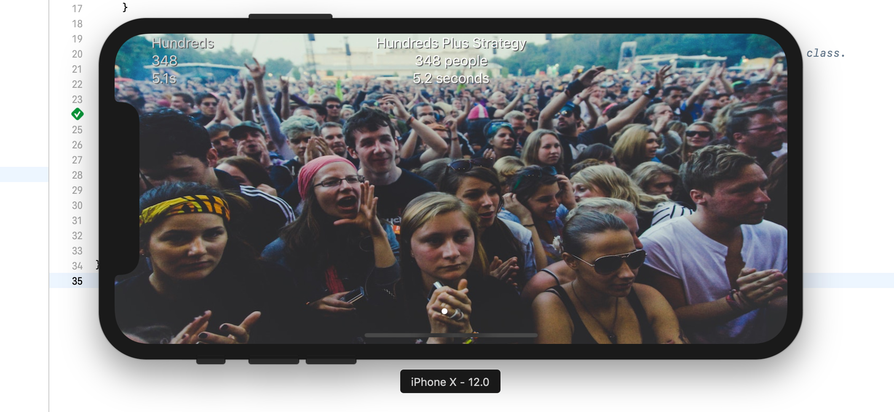
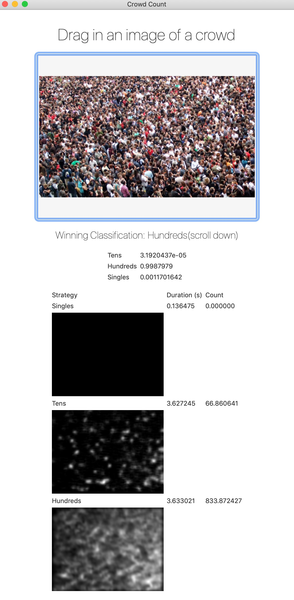
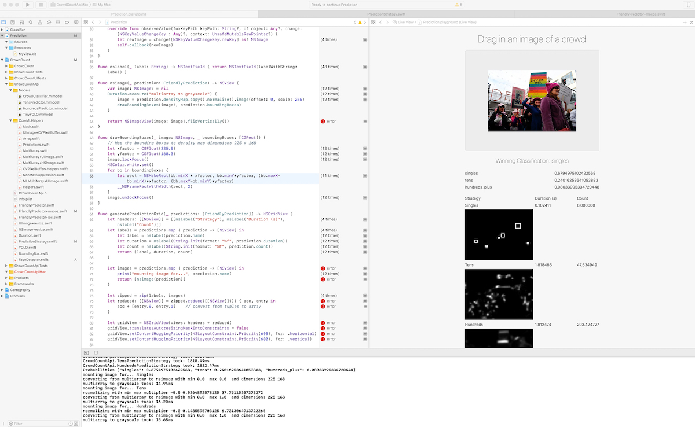

# Overview

The Apple CoreML can be divided into two implementations:

1. iOS Crowd Counting Application
2. macOS App (Ported from Prediction.playground because playgrounds are too fickle)

## iOS Crowd Counting

## macOS

Ability to drag and drop an image to see the results of different prediction strategies.

## Setup

1. Use Xcode 10+ for Swift 4.2, and macOS Mojave for Core ML 2 and Create ML.
2. Install carthage.
3. `carthage update --platform ios,macos` or `carthage bootstrap`.
4. Build CrowdCount and CrowdCountMac. For Prediction.playground, explicitly build the libraries CrowdCountApi and CrowdCountApiMac.
5. For iOS app, use [Google Firebase](https://firebase.google.com/) to create a standard bare bones `GoogleService-Info.plist`
or just delete the file `GoogleService-Info.plist` from Xcode. Used for image upload on request.

### iOS todo

- [x] Release v0.2
- [ ] Allow users to select correct classification to help model training
- [ ] Ability to select a photo from the library and segue to show page
- [ ] Have previous prediction preview and count “roll” to the left to imply that it’s working over time (animation).
