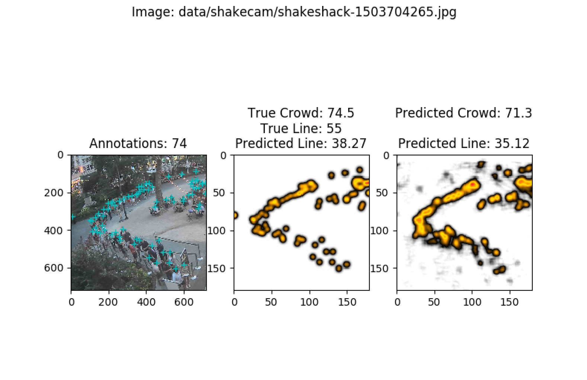
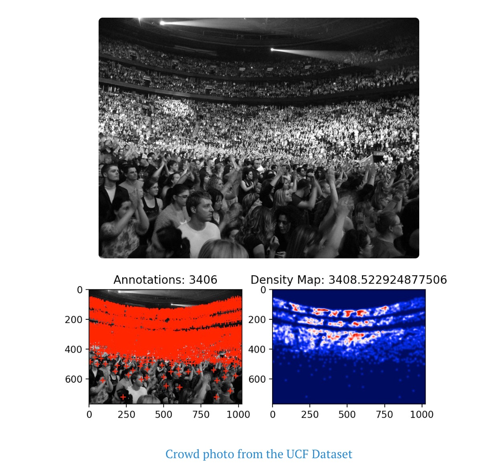

# Machine Learning (ML) Backend of Count

Houses all data science, image manipulation, and machine learning software.

Used with [Floyd Hub](https://www.floydhub.com/).





Detailed explanation [here](http://blog.dimroc.com/2017/11/19/counting-crowds-and-lines/).

## Setup:

```
# Install docker
pyenv install conda # or wtever u do to get conda going
conda-env create -f environment.yml # or something like this

./manage.py --help
```

## Running

```
./manage.py --help

[crowdcount]
    folder_to_video
    keep_every_tenth_frame
    mall_to_video
    predict
    preview_label
    rpcserver
    shakecam_paths
    shakecam_to_video
    train_density
    train_linecount
    turk_to_annotations
    upload_image
    convert_to_coreml
```

### Running with Rails application

```
# Run two grpc servers:
./manage.py rpcserver --mlversion 1
./manage.py rpcserver --mlversion 2

# Rails will auto connect
```

## Weights and Versions

### Density Versions

1. Copy of [FCN For Crowd Counting](https://arxiv.org/pdf/1612.00220.pdf) with loss value of 8.72e-6. Floyd old run 26.
2. [Custom 3 column FCN](https://arxiv.org/abs/1702.02359) with kernel sizes 9, 5, 3 based on 1. with a loss value of 6.88e-6. Floyd run 24.

### Linecount Versions

1. 3 dense layers with 4m parameters with a loss value of 27.6. Floyd run 14.
2. 2 dense layers with 1m parameters trained to a larger dataset with a loss value of 21.12. Floyd run 35.

---

### Training notes


```
sgd:
  optimizer=keras.optimizers.sgd(lr=1e-7, momentum=0.9, decay=5e-4),

adam:
optimizer=keras.optimizers.adam(lr=0.00001, decay=0.00005), # Had loss function of mean_squared_error
epoch 30:
optimizer=keras.optimizers.adam(lr=1e-7, decay=5e-4), # Had loss function of mean_absolute_error


run 20:
optimizer=keras.optimizers.adam(lr=1e-7, decay=5e-4), # Had loss function of mean_absolute_error

run 21:
optimizer=keras.optimizers.adam(lr=1e-6, decay=5e-4), # Had loss function of mean_square_error

run 23:
only using shakecam data and mean_square_error

run 24:
lr=1e-8 using only shakecam data

run 25:
like 24 but w loss function of mean_absolute_error

run 26: # Best one yet?
    model.compile(loss='mean_squared_error',
                  optimizer=keras.optimizers.adam(lr=1e-5, decay=5e-5),
                  metrics=['mae', 'mse', 'accuracy'])

run 27:  # Looking like a garbage run
    model.compile(loss='mean_absolute_error',
                  optimizer=keras.optimizers.adam(lr=1e-4, decay=5e-5),
                  metrics=['mae', 'mse', 'accuracy'])


run 30:
  \_instance = regression.Model("tmp/floyd/linecount/30/weights.95-42.84.hdf5")
  ml linecount
  self.model.compile(loss='mean_squared_error',
          optimizer=keras.optimizers.adam(lr=1e-4, decay=5e-5),
          metrics=['mse', 'mae', 'accuracy'])
        self.model = Sequential([
            Flatten(input_shape=(180, 180)),
            Dense(4096),
            Activation('relu'),
            Dense(32),
            Activation('relu'),
            Dense(1)
        ])
        Total params: 132,845,633
  NO MASK

run 31:  #GARBAGE # Started: Have normal predictions use masks
  ml linecount
  self.model.compile(loss='mean_squared_error',
          optimizer=keras.optimizers.adam(lr=1e-5, decay=5e-5),
          metrics=['mse', 'mae', 'accuracy'])
  w MASK
  # Learning rate was too high


run 2:  # reduced size
  ml linecount
  self.model.compile(loss='mean_squared_error',
          optimizer=keras.optimizers.adam(lr=1e-6),
          metrics=['mse', 'mae', 'accuracy'])
        self.model = Sequential([
            AveragePooling2D(input_shape=(180, 180)),
            Flatten(),
            Dense(2048),
            Activation('relu'),
            Dense(32),
            Activation('relu'),
            Dense(1)
        ])
        Total params: 16,656,449
  w MASK

run 4:  # reduced size. Looking like garbage
  ml linecount
  self.model.compile(loss='mean_squared_error',
          optimizer=keras.optimizers.adam(lr=1e-4, decay=5e-4),
          metrics=['mse', 'mae', 'accuracy'])
        self.model = Sequential([
            AveragePooling2D(input_shape=(180, 180)),
            Flatten(),
            Dense(2048),
            Activation('relu'),
            Dense(32),
            Activation('relu'),
            Dense(1)
        ])
        Total params: 16,656,449
  w MASK


run 5: # super small size
  ml linecount
      self.model = Sequential([
        AveragePooling2D(input_shape=(180, 180, 1)),
        Flatten(),
        Dense(1024, activation='relu'),
        Dense(1, activation='relu')
    ])

    if existing_weights:
        print("Loading weights for linecount from {}".format(existing_weights))
        self.model.load_weights(existing_weights)
        self.initial_epoch = ml.fetch_epoch(existing_weights)
    else:
        self.initial_epoch = 0

    self.model.compile(loss='mean_squared_error',
            optimizer=keras.optimizers.adam(lr=1e-5, decay=5e-4),
            metrics=['mse', 'mae', 'accuracy'])
    w MASK
    Total Params: 8,296,449

run 6:
        self.model = Sequential([
            AveragePooling2D(input_shape=(180, 180, 1)),
            Flatten(),
            Dense(4096, activation='relu'),
            Dense(1, activation='relu')
        ])

        self.model.compile(loss='mean_squared_error',
                optimizer=keras.optimizers.adam(lr=1e-6),
                metrics=['mse', 'mae', 'accuracy'])
      w MASK
      Total params: 33,185,793

run 7: # super small but deep size
        self.model = Sequential([
            MaxPooling2D(input_shape=(180, 180, 1)),
            Flatten(),
            Dense(1024, activation='relu'),
            Dense(1024, activation='relu'),
            Dense(1, activation='relu')
        ])

        self.model.compile(loss='mean_squared_error',
                optimizer=keras.optimizers.adam(lr=1e-5, decay=5e-4),
                metrics=['mse', 'mae', 'accuracy'])
    w MASK
    Total params: 9,346,049

run 9: # extra small but deep size. Promising, current winner!
        self.model = Sequential([
            MaxPooling2D(input_shape=(180, 180, 1)),
            Flatten(),
            Dense(512, activation='relu'),
            Dense(1, activation='relu')
        ])

        self.model.compile(loss='mean_squared_error',
                optimizer=keras.optimizers.adam(lr=1e-4, decay=5e-6), # it's actually 6
                metrics=['mse', 'mae', 'accuracy'])
    w MASK
    Total params: 4,148,225

run 10: # extra small but deep size
        self.model = Sequential([
            MaxPooling2D(input_shape=(180, 180, 1)),
            Flatten(),
            Dense(512, activation='relu'),
            Dense(1, activation='relu')
        ])

        self.model.compile(loss='mean_squared_error',
                optimizer=keras.optimizers.adam(lr=1e-5),
                metrics=['mse', 'mae', 'accuracy'])
    w MASK
    Total params: 4,148,225

run 14: # extra small but deep size
        self.model = Sequential([
            MaxPooling2D(input_shape=(180, 180, 1)),
            Flatten(),
            Dense(512, activation='relu'),
            Dense(512, activation='relu'),
            Dense(1, activation='relu')
        ])

        self.model.compile(loss='mean_squared_error',
                optimizer=keras.optimizers.adam(lr=1e-5, decay=5e-7),
                metrics=['mse', 'mae', 'accuracy'])

    w MASK
    Total params: 4,148,225

run 16: xs, deep, w dropout
        self.model = Sequential([
            MaxPooling2D(input_shape=(180, 180, 1)),
            Flatten(),
            Dense(512, activation='relu'),
            Dropout(0.5),
            Dense(512, activation='relu'),
            Dropout(0.5),
            Dense(1, activation='relu')
        ])

        self.model.compile(loss='mean_squared_error',
                optimizer=keras.optimizers.adam(lr=1e-5, decay=5e-7),
                metrics=['mse', 'mae', 'accuracy'])
    w MASK
    Total params: 4,148,225

-------------

## V2: new school

run 19: xs, deep, w dropout
        self.model = Sequential([
            MaxPooling2D(input_shape=(180, 180, 1)),
            Flatten(),
            Dense(512, activation='relu'),
            Dropout(0.5),
            Dense(512, activation='relu'),
            Dropout(0.5),
            Dense(1, activation='relu')
        ])

        self.model.compile(loss='mean_squared_error',
                optimizer=keras.optimizers.adam(lr=1e-5, decay=5e-7),
                metrics=['mse', 'mae', 'accuracy'])
    w MASK
    Total params: 4,148,225

run 20: xs deep, w dropout
            self.model = Sequential([
                MaxPooling2D(input_shape=(180, 180, 1)),
                MaxPooling2D(input_shape=(90, 90, 1)),
                Flatten(),
                Dense(512, activation='relu', kernel_regularizer=regularizers.l2(0.01)),
                Dropout(0.5),
                Dense(1, activation='relu')
            ])
            self.model.compile(loss='mean_squared_error',
                    optimizer=keras.optimizers.adam(lr=1e-5, decay=5e-7),
                    metrics=['mse', 'mae', 'accuracy'])
            self.initial_epoch = 0


run 21: xxs, my money is on this one.
            self.model = Sequential([
                MaxPooling2D(input_shape=(180, 180, 1)),
                MaxPooling2D(input_shape=(90, 90, 1)),
                Flatten(),
                Dropout(0.5),
                Dense(512, activation='relu'),
                Dropout(0.5),
                Dense(1, activation='relu')
            ])
            self.model.compile(loss='mean_squared_error',
                    optimizer=keras.optimizers.adam(lr=1e-5, decay=1e-8),
                    metrics=['mse', 'mae', 'accuracy'])


run 22: xxs deep, w 1 dropout layer
            self.model = Sequential([
                MaxPooling2D(input_shape=(180, 180, 1)),
                MaxPooling2D(input_shape=(90, 90, 1)),
                Flatten(),
                Dense(512, activation='relu'),
                Dropout(0.5),
                Dense(1, activation='relu')
            ])
            self.model.compile(loss='mean_squared_error',
                    optimizer=keras.optimizers.adam(lr=1e-5, decay=1e-8),
                    metrics=['mse', 'mae', 'accuracy'])

run 23: 4cols density model
    inputs = Input(shape=(None, None, 3))
    x = Conv2D(64, kernel_size=(9, 9), activation='relu', padding='same')(inputs)
    cols = [_create_column(d, x) for d in [3, 5, 7, 9]]
    out = average(cols)
    model = KModel(inputs=inputs, outputs=out)
    return _compile_model(model)


    def _create_column(kernel_dimension, inputs):
        kd = kernel_dimension
        x = Conv2D(36, kernel_size=(kd, kd), activation='relu', padding='same')(inputs)
        x = MaxPooling2D(pool_size=(2, 2), strides=(2, 2))(x)
        x = Conv2D(72, (kd, kd), activation='relu', padding='same')(x)
        x = MaxPooling2D(pool_size=(2, 2), strides=(2, 2))(x)
        x = Conv2D(36, (kd, kd), activation='relu', padding='same')(x)
        x = Conv2D(24, (kd, kd), activation='relu', padding='same')(x)
        x = Conv2D(16, (kd, kd), activation='relu', padding='same')(x)
        return Conv2D(1, (1, 1), padding='same', kernel_initializer='random_normal')(x)
    def _compile_model(model):
        model.compile(loss='mean_squared_error',
                      optimizer=keras.optimizers.adam(lr=1e-5, decay=5e-5),
                      metrics=['mae', 'mse', 'accuracy'])

run 24: 3cols extra deep density model
      inputs = Input(shape=(None, None, 3))
      x = Conv2D(64, kernel_size=(9, 9), activation='relu', padding='same')(inputs)
      cols = [_create_column(d, x) for d in [3, 5, 9]]
      averaged = average(cols)
      output = Conv2D(1000, (1, 1), activation='relu')(averaged)
      output = Conv2D(1, (1, 1), activation='relu')(output)
      model = KModel(inputs=inputs, outputs=output)
      return _compile_model(model)


  def _create_column(kernel_dimension, inputs):
      kd = kernel_dimension
      x = Conv2D(16, kernel_size=(kd, kd), activation='relu', padding='same')(inputs)
      x = MaxPooling2D(pool_size=(2, 2), strides=(2, 2))(x)
      x = Conv2D(32, (kd, kd), activation='relu', padding='same')(x)
      x = Conv2D(32, (kd, kd), activation='relu', padding='same')(x)
      x = MaxPooling2D(pool_size=(2, 2), strides=(2, 2))(x)
      if kd == 9:
          kd = 7
      x = Conv2D(64, (kd, kd), activation='relu', padding='same')(x)
      x = Conv2D(64, (kd, kd), activation='relu', padding='same')(x)
      return Conv2D(1, (1, 1), padding='same', kernel_initializer='random_normal')(x)
######### TODO: Redo the one above ^^ but remove the last col Conv2D layer of 1 (1,1)


  def _compile_model(model):
      model.compile(loss='mean_squared_error',
                    optimizer=keras.optimizers.adam(lr=1e-5, decay=5e-5),
                    metrics=['mae', 'mse', 'accuracy'])

run 25: 3 FCN cols density model
      inputs = Input(shape=(None, None, 3))
      cols = [_create_column(d, inputs) for d in [3, 5, 9]]
      model = KModel(inputs=inputs, outputs=average(cols))
      return _compile_model(model)


  def _create_column(kernel_dimension, inputs):
      kd = kernel_dimension
      x = Conv2D(36, kernel_size=(kd, kd), activation='relu', padding='same')(inputs)
      x = MaxPooling2D(pool_size=(2, 2), strides=(2, 2))(x)
      if kd == 9:
          kd = 7
      x = Conv2D(72, (kd, kd), activation='relu', padding='same')(x)
      x = MaxPooling2D(pool_size=(2, 2), strides=(2, 2))(x)
      x = Conv2D(36, (kd, kd), activation='relu', padding='same')(x)
      x = Conv2D(24, (kd, kd), activation='relu', padding='same')(x)
      x = Conv2D(16, (kd, kd), activation='relu', padding='same')(x)
      return Conv2D(1, (1, 1), activation='relu', kernel_initializer='random_normal')(x)


  def _compile_model(model):
      model.compile(loss='mean_squared_error',
                    optimizer=keras.optimizers.adam(lr=1e-5, decay=5e-5),
                    metrics=['mae', 'mse', 'accuracy'])

run 30: xxs deep, w 1 dropout layer
            self.model = Sequential([
                MaxPooling2D(input_shape=(180, 180, 1)),
                MaxPooling2D(input_shape=(90, 90, 1)),
                Flatten(),
                Dense(512, activation='relu'),
                Dropout(0.5),
                Dense(1, activation='relu')
            ])
            self.model.compile(loss='mean_squared_error',
                    optimizer=keras.optimizers.adam(lr=1e-5, decay=1e-6),
                    metrics=['mse', 'mae', 'accuracy'])

run 31: 3 FCN cols density model

    inputs = Input(shape=(None, None, 3))
    cols = [_create_column(d, inputs) for d in [3, 5, 9]]
    model = KModel(inputs=inputs, outputs=average(cols))
    return _compile_model(model)


  def _create_column(kernel_dimension, inputs):
      kd = kernel_dimension
      x = Conv2D(36, kernel_size=(kd, kd), activation='relu', padding='same')(inputs)
      x = MaxPooling2D(pool_size=(2, 2), strides=(2, 2))(x)
      x = Conv2D(72, (kd, kd), activation='relu', padding='same')(x)
      x = MaxPooling2D(pool_size=(2, 2), strides=(2, 2))(x)
      x = Conv2D(36, (kd, kd), activation='relu', padding='same')(x)
      if kd == 9:
          kd = 7
      x = Conv2D(24, (kd, kd), activation='relu', padding='same')(x)
      x = Conv2D(16, (kd, kd), activation='relu', padding='same')(x)
      return Conv2D(1, (1, 1), activation='relu', kernel_initializer='random_normal')(x)


  def _compile_model(model):
      model.compile(loss='mean_squared_error',
                    optimizer=keras.optimizers.adam(lr=1e-6, decay=5e-6),
                    metrics=['mae', 'mse', 'accuracy'])


run 32: 3 FCN multicols density model ONLY SHAKECAM

    inputs = Input(shape=(None, None, 3))
    cols = [_create_column(d, inputs) for d in [3, 5, 9]]
    model = KModel(inputs=inputs, outputs=average(cols))
    return _compile_model(model)


def _create_column(kernel_dimension, inputs):
    kd = kernel_dimension
    x = Conv2D(36, kernel_size=(kd, kd), activation='relu', padding='same')(inputs)
    x = MaxPooling2D(pool_size=(2, 2), strides=(2, 2))(x)
    x = Conv2D(72, (kd, kd), activation='relu', padding='same')(x)
    x = MaxPooling2D(pool_size=(2, 2), strides=(2, 2))(x)
    x = Conv2D(36, (kd, kd), activation='relu', padding='same')(x)
    if kd == 9:
        kd = 7
    x = Conv2D(24, (kd, kd), activation='relu', padding='same')(x)
    x = Conv2D(16, (kd, kd), activation='relu', padding='same')(x)
    return Conv2D(1, (1, 1), activation='relu', kernel_initializer='random_normal')(x)


def _compile_model(model):
    model.compile(loss='mean_squared_error',
                  optimizer=keras.optimizers.adam(lr=1e-6, decay=5e-6),
                  metrics=['mae', 'mse', 'accuracy'])
    return model

run 33: shake cam and mall
  def _create_msb_model():
      inputs = Input(shape=(None, None, 3))
      x = Conv2D(64, kernel_size=(9, 9), activation='relu', padding='same')(inputs)
      x = _create_msb(16, [9, 7, 5, 3], x)
      x = MaxPooling2D(pool_size=(2, 2), strides=(2, 2))(x)
      x = _create_msb(32, [9, 7, 5, 3], x)
      x = _create_msb(32, [9, 7, 5, 3], x)
      x = MaxPooling2D(pool_size=(2, 2), strides=(2, 2))(x)
      x = _create_msb(64, [7, 5, 3], x)
      x = _create_msb(64, [7, 5, 3], x)
      x = Conv2D(1000, (1, 1), activation='relu')(x)
      x = Conv2D(1, (1, 1), activation='relu')(x)
      model = KModel(inputs=inputs, outputs=x)
      return _compile_model(model)


  def _create_msb(filters, dimensions, inputs):
      cols = [Conv2D(filters, kernel_size=(d, d), activation='relu', padding='same')(inputs) for d in dimensions]
      return average(cols)


  def _compile_model(model):
      model.compile(loss='mean_squared_error',
                    optimizer=keras.optimizers.adam(lr=1e-5, decay=5e-6),
                    metrics=['mae', 'mse', 'accuracy'])
      return model

run 34:
            self.model = Sequential([
                MaxPooling2D(input_shape=(180, 180, 1)),
                MaxPooling2D(input_shape=(90, 90, 1)),
                Flatten(),
                Dense(512, activation='relu'),
                Dropout(0.5),
                Dense(1, activation='relu')
            ])
            self.model.compile(loss='mean_squared_error',
                    optimizer=keras.optimizers.adam(lr=1e-5, decay=1e-5),
                    metrics=['mse', 'mae', 'accuracy'])

run 35: ## Looks like the winner for linecounting!
            self.model = Sequential([
                MaxPooling2D(input_shape=(180, 180, 1)),
                Flatten(),
                Dropout(0.5),
                Dense(512, activation='relu'),
                Dropout(0.5),
                Dense(1, activation='relu')
            ])
            self.model.compile(loss='mean_squared_error',
                    optimizer=keras.optimizers.adam(lr=1e-5, decay=5e-5),
                    metrics=['mse', 'mae', 'accuracy'])
            self.initial_epoch = 0

run 39: multiscale blob SGD! Identical optimization parameters to paper
    model.compile(loss='mean_squared_error',
                  optimizer=keras.optimizers.sgd(lr=1e-7, decay=5e-4),

run 40: multiscale blob adam, with better weight initialization
    x = Conv2D(1, (1, 1), activation='relu', kernel_initializer='random_normal')(x)
    model.compile(loss='mean_squared_error',
                  optimizer=keras.optimizers.adam(lr=1e-5, decay=5e-4),
                  metrics=['mae', 'mse', 'accuracy'])

run 41: multiscale blob adam, with better weight initialization
    x = Conv2D(1, (1, 1), activation='relu', kernel_initializer='random_normal')(x)
    model.compile(loss='mean_squared_error',
                  optimizer=keras.optimizers.adam(lr=1e-8, decay=5e-4),
                  metrics=['mae', 'mse', 'accuracy'])

run 42: multiscale blob adam, with better weight initialization
    x = Conv2D(1, (1, 1), activation='relu', kernel_initializer='random_normal')(x)
    model.compile(loss='mean_squared_error',
                  optimizer=keras.optimizers.adam(lr=1e-7, decay=5e-4),
                  metrics=['mae', 'mse', 'accuracy'])

run 43: multiscale blob adam, with better weight initialization
    x = Conv2D(1, (1, 1), activation='relu', kernel_initializer='random_normal')(x)
    model.compile(loss='mean_squared_error',
                  optimizer=keras.optimizers.adam(lr=1e-7, decay=5e-3),
                  metrics=['mae', 'mse', 'accuracy'])

## Winner Winner Chicken Dinner number 44
run 44: multiscale blob adam, with better weight initialization
    x = Conv2D(1, (1, 1), activation='relu', kernel_initializer=_msb_initializer)(x)
    model.compile(loss='mean_squared_error',
                  optimizer=keras.optimizers.adam(lr=1e-5, decay=5e-5),
                  metrics=['mae', 'mse', 'accuracy'])

run 45: Copied from 44 epoch 5 and then increased decay to 5e-4

Run 46: Identical to 44, just only trained with shakecam data

## TODO

- Train only w shakecam dataset
- Create proper Multiscale blobs (MSB)

```
